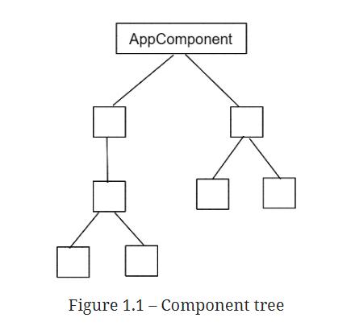
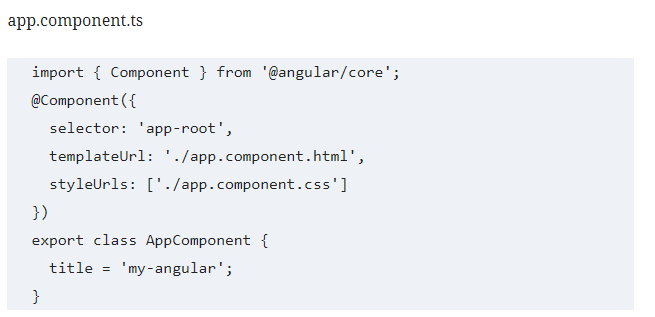

OmShanthi                                                                                             ShivaBaba

# Angular learning's notes

## Table of Contents

* [Angular History](#angular-history)
* [Angular Basics](#angular-basics)
* [Angular Prerequisite](#angular-prerequisite)
* [Angular CLI Reference](#angular-cli-reference)
* [References](#references)

## Angular History

*   AngularJS developed by Miško Hevery and announced in 2009 

*   Later AngularJS became popular framework for building web applications

*   The AngularJS project was brought into Google, and version 1.0 was officially launched in October 2010

*   Angular VS AngularJS

    *   **Any release from 1.0 through 2.0 is known as AngularJS**
    
    *   **For versions 2.0 and greater, it’s known as just Angular.** 
        Version 2.0 was a complete rewrite, and all versions after it are planned as incremental changes upon it.
  
*   Reference: Angular in Action    -   Jeremy Wilken      

## Angular Basics

*   **Angular is a platform and framework for building single page applications using HTML and TypeScript**

*   Angular can run on different platforms apart from web, such as Desktop and Mobile

*   **Angular applications are written in TypeScript, a superset of JavaScript that provides syntactic sugar 
    such as strong typing and object-oriented techniques.**

*   Angular core functionality and optional functionality available as Typescript libraries. 
    Angular applications import these typescript libraries to use
    
*   Angular applications are created and developed using a command-line tool made by the Angular team called the Angular CLI. 
    It automates many development tasks, such as scaffolding, testing, and deploying an Angular application, 
    which would take a lot of time to configure manually.

*   **The popularity of the Angular framework is considerably reflected in its broad support of tooling**    

*   **The architecture of an Angular application is based on a hierarchical representation of components**

*   **Components are the fundamental building blocks of an Angular application.** They represent and control a particular portion of a web page called the view

*   Some examples of components are as follows:

    *   A list of customers
    *   A list of claims
 
*   Components of an Angular application can be logically organized as a tree: Angular components can be visualized like below

       

            
       

*   **Any Angular application typically has one main component, called AppComponent, by convention**   

*   Each component in the tree can communicate and interact with its siblings using an application programming interface defined by each one.

*   **Each component has an associated typescript class that is responsible for handing the business logic and template that represents the view layer**

*   Multiple, closely related components can be stacked together to create a module

 

## Angular Prerequisite

*   To work with Angular applications you should install below list of software's in desktop

       *    NodeJS and NPM
       *    Yarn [Optional, but recommended]
       *    Angular CLI
       *    http-server [Optional, but recommended] 
       *    git
       *    IDE    

*   Installation of NodeJS and NPM

      *    Download and install Node.js from the official Node.js website, https://nodejs.org. Click the download link on the website. 
           This site lists installers for long-term support (LTS) and the latest version. Preferably choose LTS.
           Next select an option based on your operating system and platform. It will download the installer
         
      *    This installer installs Node.js and NPM. Current LTS of Node.js and NPM are 18.12.1 and NPM is 8.19.2
      
*   Installation of Yarn

      *    While NPM is the default package manager with Node.js, Yarn is an open source project backed by Facebook. 
      
      *    It has received traction in the developer community due to its strengths in performance and security
      
      *    To install Yarn, run the following command:
      
      *    **npm install -g yarn**
      
      *    **Note:**   The option -g, which stands for “global.” The package is available across all the projects and the directories.
                       Hence, it might need elevated permissions to run and install.On a Windows machine, run this command as an administrator.
                       
                       
*   Installation of Angular CLI

      *    While working with Angular applications, Angular CLI is a highly useful command-line tool. 
      
      *    You will be using this tool for all Angular-related tasks including creating projects, adding new Angular components, using Angular services, 
           running the Angular application, doing build-related tasks, etc.
                 
      *    Install Angular CLI with the following command:
      
      *    **npm install -g @angular/cli      or      yarn global add @angular/cli**                                       
                       
      *    To verify the installation has been successful, run the below command 
                                                    
      *    ng  version
      

*   Installation of Http-server

      *    Http-server is a quick and efficient way to run a node.js based web server for static files
      
      *    During development, you will be using this NPM package for working with the cached application
      
      *    **yarn gloabl add http-server**
      
      *    To verify the installation has been successful, run the below command
      
      *    http-server --version
      
            
*    Angular IDE tools are:

      *    Microsoft visual studio code
      *    Sublime text
      *    WebStorm [form Intellij]
      *    Atom      
                    

## Angular CLI Reference

*   Below are Angular CLI options every developer should be aware of

       *   **serve:**       Build and serve an Angular application.
       *   **build:**       Build an Angular application.
       *   **test:**        Run the unit tests of an Angular application
       *   **generate:**    Generate a new Angular artifact, such as a component or module.
       *   **add:**         Install a third-party library that is compatible with the Angular framework.
       *   **new:**         Create a new Angular application.
       *   **help:**        If you want to view all the available commands    
       
*   **ng new:** creates new Angular application with following features

       *   Scaffolding the necessary folder structure of a typical Angular project
       *   Installing the required npm dependencies and Angular packages
       *   Initializing Git in the Angular CLI project                    
    
*   Creation of new Angular project might take some time, depending on the speed of the network

*   **ng serve:** This will build the Angular application and start a built-in web server that we can use to preview it. 
    The web server is started in watch mode; that is, it automatically rebuilds the Angular application whenever we make a change in the code.
    
*   The first time an Angular application is built, it takes a considerable amount of time to complete, so we must be patient.

*   Open browser and navigate to **http://localhost:4200** to get a preview of your new Angular application

*   The application source code resides inside the src/app folder

*   Below is the typescript code of app component - app.component.ts

     

        
     

     
*   The following properties characterize an Angular component:

       *  **selector:** A unique name that is used to identify and declare the component inside HTML content. 
                        It is used as an HTML tag, just like any native HTML element, such as <app-root></app-root>.
                        
       *  **templateUrl:** The path pointing to an HTML file that contains the HTML content of the component, which is called the template of the component.
       
       *  **styleUrls:**  A list of paths where each one points to a stylesheet file containing the CSS styles of the component.
       
*   The preceding properties are defined using the @Component decorator. It is a function that decorates the TypeScript class of the component and recognizes it as an Angular component. 
    The title property of the AppComponent class is a public property that contains a string value and can be used in the template of the component.
    
                                               

         

## References

*   Full Stack AngularJS for Java Developers: Build a Full-Featured Web Application from Scratch Using AngularJS with Spring RESTful    -   Ravi Kant Soni

*   Angular official documentation  -   https://angular.io/docs

*   Angular Projects - Second Edition   -   Aristeidis Bampakos, Mark Thompson